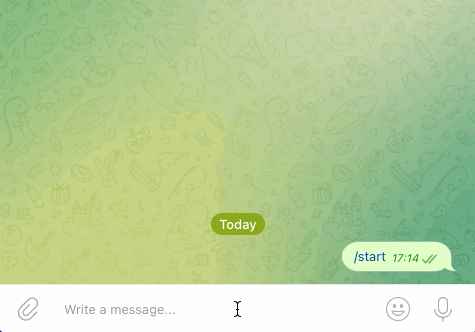

# Бот для продажи морепродуктов.
Данные скрипты позволяют помочь создать бота для продаж морепродуктов в Телеграм.
Попробовать можно в [Телеграм](https://t.me/seafood_store_bot)
Ну или посмотреть демо: 
### Как установить
- [Python3](https://www.python.org/downloads/) должен быть уже установлен. 
- Установить [виртуальное окружение](https://python-scripts.com/virtualenv).

1. Настройки для бота Телеграм.
- Создайте Телеграм бота  и получите токен. Сделать это можно тут: [BotFather](https://telegram.me/BotFather), для этого необходимо
ввести `/start` и следовать инструкции.
- Запишите полученный токен в '.env' как:
```python
TG_TOKEN='тут ваш токен'
```  
- Запустите полученного бота при помощи команды `/start`.

2. Поднять базу данных на [Redis](https://redis.com).
- Запишите полученные параметры в '.env' как:
```python
REDIS_PORT='тут ваш порт'
``` 
```python
REDIS_PASSWORD='тут ваш пароль'
``` 
```python
REDIS_HOST='тут ваш хост'
```

3. Создайте магазин в [Мoltin](https://www.elasticpath.com).
- Запишите полученные параметры в '.env' как:
```python
MOLTIN_CLIENT_ID='тут ваш ID, пример: 1zfi9vOcmflEYsRvMeEYCpI4dxzIDDvixwNfXnyJqq'
``` 
```python
MOLTIN_CLIENT_SECRET_KEY='тут ваш секретный ключ'
``` 

### Как запустить
1. Скачайте код
2. Установите зависимости командой:
```bash
pip install -r requirements.txt
```
3. Запустите скрипт:
```bash
python3 tg_seafood_store_bot.py
```

### Как запустить на Хероку
1. Зарегистрируйтесь на [Хероку](https://id.heroku.com/login)
2. Создайте приложение (app). 
3. Привяжете аккаунт GitHub к аккаунту Heroku во вкладке Deploy и нажмите Deploy Branch. 
   Если не получилось привязать аккаунт, воспользуйтесь [инструкцией для терминала](https://devcenter.heroku.com/articles/git)
4. Заполните чувствительные данные Config Vars из файла `.env` во вкладке Settings.

5. Активируйте Dyno во вкладке Resources. 

Готово, теперь ваш бот будет работать постоянно.
